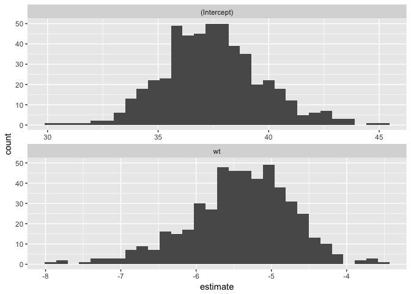
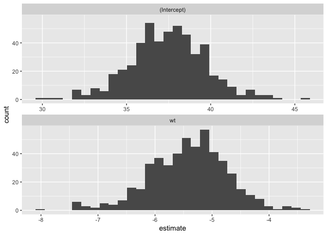

Lazy Sampling objects
=====================

[](https://travis-ci.org/jrnold/lazysample) [](https://codecov.io/gh/jrnold/lazysample)

The **lazysample** package provides functions that implement several resampling methods including bootstrapping and cross-validation.

The building block of these methods is the `lazy_sample` object.

``` r
library("lazysample")
smpl <- lazy_sample(mtcars, 1:10)
```

Instead of computing the samples immediately, when the lazy sample object is created it stores a quosure, which is an unevaluated expression and its environment, and the indexes to extract.

``` r
smpl$quo
#> <quosure: frame>
#> ~mtcars
smpl$idx
#>  [1]  1  2  3  4  5  6  7  8  9 10
```

The sample is only lazily computed when it is needed.

``` r
smpl$sample
#>                    mpg cyl  disp  hp drat    wt  qsec vs am gear carb
#> Mazda RX4         21.0   6 160.0 110 3.90 2.620 16.46  0  1    4    4
#> Mazda RX4 Wag     21.0   6 160.0 110 3.90 2.875 17.02  0  1    4    4
#> Datsun 710        22.8   4 108.0  93 3.85 2.320 18.61  1  1    4    1
#> Hornet 4 Drive    21.4   6 258.0 110 3.08 3.215 19.44  1  0    3    1
#> Hornet Sportabout 18.7   8 360.0 175 3.15 3.440 17.02  0  0    3    2
#> Valiant           18.1   6 225.0 105 2.76 3.460 20.22  1  0    3    1
#> Duster 360        14.3   8 360.0 245 3.21 3.570 15.84  0  0    3    4
#> Merc 240D         24.4   4 146.7  62 3.69 3.190 20.00  1  0    4    2
#> Merc 230          22.8   4 140.8  95 3.92 3.150 22.90  1  0    4    2
#> Merc 280          19.2   6 167.6 123 3.92 3.440 18.30  1  0    4    4
```

Lists and list-columns in data frames can easily be used for tidy model evaluation. The function `lazy_sample_idx` produces a data frame with a list-column of resample objects. For example, this resamples from the `mtcars` data frame using a simple non-parametric bootstrap.

``` r
library("tidyverse")
#> Loading tidyverse: ggplot2
#> Loading tidyverse: tibble
#> Loading tidyverse: tidyr
#> Loading tidyverse: readr
#> Loading tidyverse: purrr
#> Loading tidyverse: dplyr
#> Conflicts with tidy packages ----------------------------------------------
#> filter(): dplyr, stats
#> lag():    dplyr, stats
idx <- rerun(500, sample.int(nrow(mtcars), replace = TRUE))
smpl <- lazy_sample_idx(mtcars, idx)
```

These bootstrap samples can be used to generate confidence intervals for coefficients of a model.

``` r
map(smpl$sample, ~ lm(mpg ~ wt, data = .$sample)) %>%
  map_df(broom::tidy) %>%
  ggplot(aes(x = estimate)) +
  geom_histogram() +
  facet_wrap(~ term, ncol = 1, scale = "free_x")
```



While various resampling methods can be implemented manually, this package provides functions for many common methods: including common fbootstrapping and cross-validation methods.

The `bootstrap` function in the package implements bootstrap resampling.

``` r
boot <- bootstrap(mtcars, R = 500)
map(boot$sample, ~ lm(mpg ~ wt, data = .$sample)) %>%
  map_df(broom::tidy) %>%
  ggplot(aes(x = estimate)) +
  geom_histogram() +
  facet_wrap(~ term, ncol = 1, scale = "free_x")
```



The function `crossv_kfold` implements k-fold cross validation.

``` r
cv_5k <- crossv_kfold(mtcars, 5)
models_5k <- map(cv_5k$train, ~ lm(mpg ~ wt, data = .$sample))
err_cv5k <- tibble(
  rmse = mean(map2_dbl(models_5k, cv_5k$test,
                  function(x, y) modelr::rmse(x, y$sample))),
  model = "CV 5-fold")
```

The function `crossv_mc` implements Monte Carlo cross validation in which the data is repeatedly randomly split into training and test sets.

``` r
cv_mc <- crossv_mc(mtcars, 50, frac = 0.2)
models_mc <- map(cv_mc$train, ~ lm(mpg ~ wt, data = .$sample))
err_mc <- tibble(
  rmse = mean(map2_dbl(models_mc, cv_mc$test,
           function(x, y) modelr::rmse(x, y$sample))),
  model = "CV Monte Carlo")
```

The function `crossv_loo` implements leave-one-out (LOO) cross validation in which the data are split into *n* training/test pairs in which one observation is dropped at a time.

``` r
cv_loo <- crossv_loo(mtcars)
models_loo <- map(cv_loo$train, ~ lm(mpg ~ wt, data = .$sample))
err_loo <- tibble(
  rmse = mean(map2_dbl(models_loo, cv_loo$test,
                       function(x, y) modelr::rmse(x, y$sample))),
  model = "CV-LOO")
```

``` r
bind_rows(err_cv5k, err_mc, err_loo)
#> # A tibble: 3 x 2
#>       rmse          model
#>      <dbl>          <chr>
#> 1 2.987392      CV 5-fold
#> 2 2.889619 CV Monte Carlo
#> 3 2.517436         CV-LOO
```

Installation
------------

**lazysample** is not on CRAN. You can install the development version with

``` r
# install.packages("devtools")
devtools::install_github("jrnold/lazysample")
```
